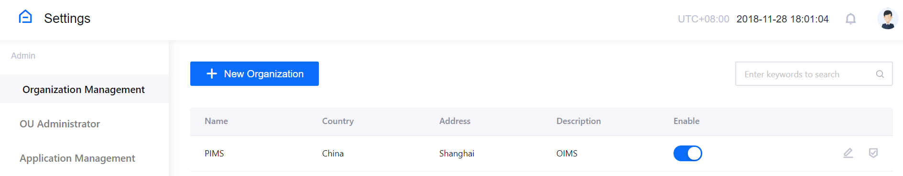
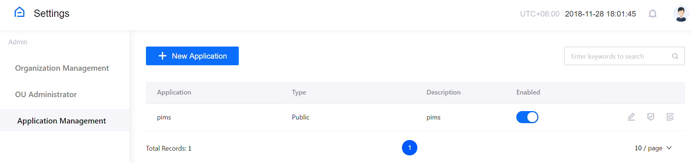
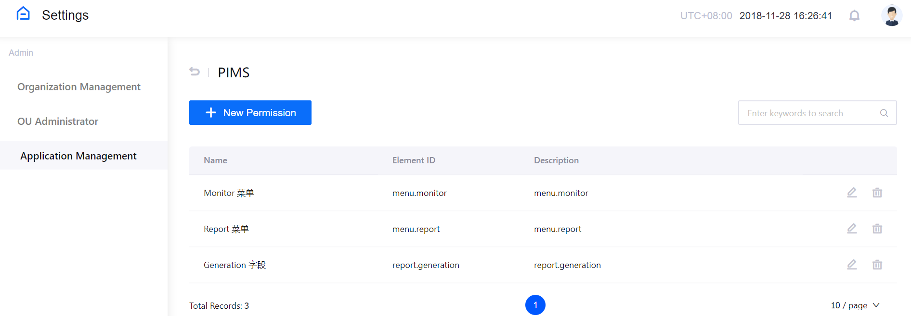
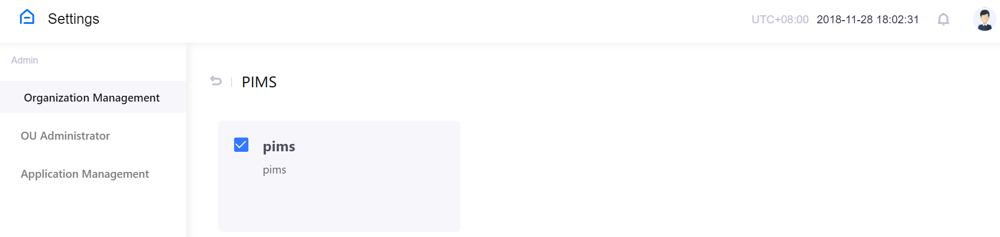
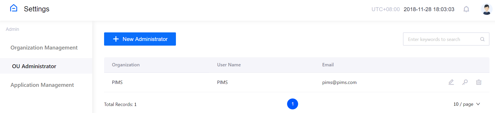
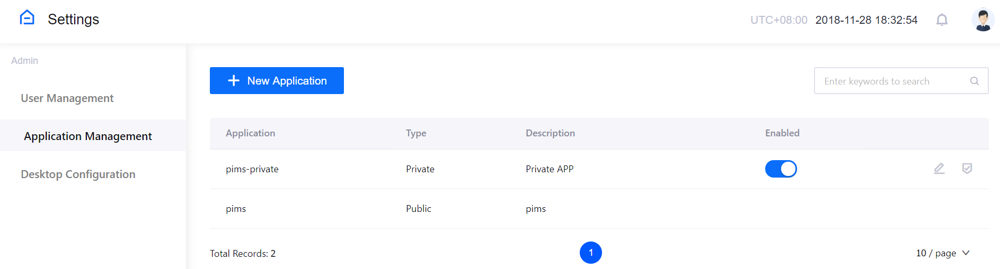
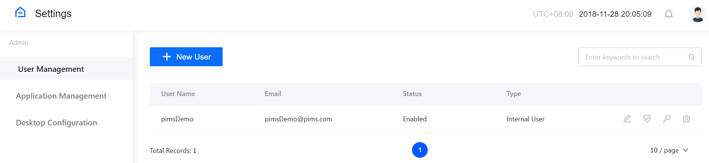
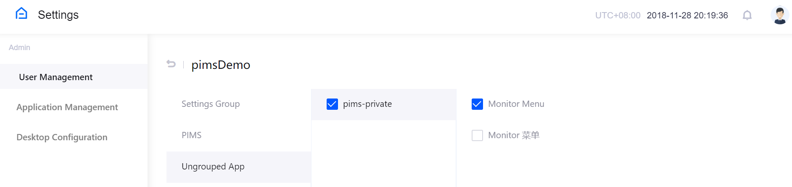

# APP Framework Quick Start Guide
## Overview

APP Framework is a standalone module provided by EnOS System to support application developers on central management of application users and access permissions within the organization. It helps application developers and organization administrators efficiently manage internal and external user accounts, define application resources, and allocate resource access permissions.

### Terminology
**Application**

Software tools that are registered and developed on the EnOS Portal. In APP Framework, applications can be registered as public applications and private applications.

**Company / Organization**
Entities or units to which applications and developers belong. In APP Framework, defining company and organization information facilitates management of application users and permissions.

**Application permission**
Access control to application resources that is enabled by EnOS system. Different application permissions can be classified into several types like menu, UI view, and data, which can be granted to different users based on business requirements.

**System administrator**
EnOS platform administrator or super administrator of an organization. The system administrator is responsible for defining company/organization, registering public applications, defining application permissions, assigning applications for organizations, and creating organization administrator accounts.

**Organization administrator**
Application administrator of an organization. The organization administrator is responsible for managing applications by groups, creating user accounts, and managing user access permissions.

**Application user**
Consumer of applications by using the accounts created by the organization administrator.

### Product features
Features of the APP Framework include:

**Data integration**: EnOS system integrates connected asset data, application data, and APIs, which enables allocating resources to different users through application authorization.

**Security and reliability**: EnOS system isolates the business data of different clients and ensures data security by asset authorization. The assets of a client can only be accessed with the proactive authorization of the client.

**Cross-organization authorization**: To grant external users with resource access, clients can authorize an application with access permissions. External users can use the application to view asset information.


## Preparation

Before using the APP Framework to manage application resource permissions, the application developer needs to make corresponding configuration to the application. The preparation work includes defining application permissions, installing EnOS Web SDK to configure permissions, and deploying the application online.

### Defining application permissions

EnOS system defines application resources as application access controls, which are also called application permissions. Each application permission is granted an ID, which is also defined as "Element ID" in the APP Framework. Therefore, resources can be assigned to different users through application authorization. Application developers can plan and define application permissions according to the business requirements and user roles of the application. With the defined application permissions, the system administrator or organization administrator can configure applications in the APP Framework.

The following table shows how to define application permissions:

| Permission name           | Permission ID (Element ID) | Permission type |
| ------------------------- | -------------------------- | --------------- |
| Monitor menu              | menu.monitor               | Menu            |
| Report menu               | menu.report                | Menu            |
| Monitor #1 view           | monitor.1                  | UI View         |
| Monitor #2 view           | monitor.2                  | UI View         |
| Monitor #3 view           | monitor.3                  | UI View         |
| Diagnostic Report button  | button.dis_report          | UI View         |
| Generation field          | report.generation          | Data            |
| Severity field            | report.severity            | Data            |
| Boiler Efficiency section | view.boiler                | Data            |
| HP Heater Input Ratio     | view.hp_heater             | Data            |
| Condenser Undercooling    | view.condenser             | Data            |

### Configuring application permissions

After defining application permissions, install and use EnOS Web SDK to configure the application.

#### Installing EnOS Web SDK

URL for downloading the EnOS Web SDK on npm: [http://npm.envisioncn.com/package/@enos/portalsdk](http://npm.envisioncn.com/package/@enos/portalsdk)

Use the following command to install EnOS Web SDK:

```
npm install @enos/portalsdk --save
```

#### API

The APP Framework provides APIs for application management. Applications can retrieve user information and control page operations through the EnOS Web SDK.

Calling the APIs requires importing the portalSdk module.

```
import portalSdk from '@enos/portalsdk';
```

For the complete list of APIs and API function details, see [SDK Readme](http://npm.envisioncn.com/package/@enos/portalsdk).

#### Defining menu permissions

Add permissions with the type `Menu` in the App management module and assign corresponding application permissions to specific users. After logging in the system, users can get all the assigned permissions through the `getPermissions` API, including the configured `Menu` permission.

EnOS Web SDK provides the React `Menu` component, which supports unified display of menus with input of menu data and current user permissions. Application developers can use either the `Menu` component or customize menus with permission definition.

##### Parameters of the `Menu` component

| Property     | Description                     | Type     |
| ------------ | ------------------------------- | -------- |
| menus        | Collection of menu data         | array    |
| permissions  | Permissions of the current user | array    |
| onSelectMenu | Callback for selected menu      | function |
| theme        | Key of the current theme        | string   |

##### Sample code for the `Menu` component

```
import portalSdk from '@enos/portalsdk';
import Menu from '@enos/portalsdk/lib/Menu';

class Demo extends React.Component {
    render() {
        return (
          <Menu
              menus={customMenu}
              permissions={portalSdk.getPermissions()}
              onSelectMenu={this.onSelectMenu}
              theme={portalSdk.getTheme()} />   );
  }
}

ReactDOM.render(<Demo />, mountNode);
```

##### Menu data type of the `Menu` component

```
[
  {
    id: 'category_admin',
    title: 'Admin',
    children: [
      {
        id: 'app_user_admin_menu_company',
        title: 'Company Mgmt',
        link: '/admin/company.html'
      },
      {
        id: 'app_user_admin_menu_ouadmin',
        title: 'OU Administrator',
        link: '/admin/ouadminlist.html'
      },
      {
        id: 'app_user_admin_menu_sysapp',
        title: 'Sys App Mgmt',
        link: '/admin/sysapp.html'
      }
    ]
  }
]
```

#### Defining UI view permissions

Add the `meta-enos-view-id` attribute for elements that need `View` access control and set the permission ID as the value of the attribute.

Add permissions with the type `View` in the App management module and assign corresponding application permissions to specific users.

If users do not have the `View` permission, the `UI View` will not be visible to the users. To reserve page render place for this kind of `UI View`, add the `meta-enos-view-reserve=‘true’` attribute for the element. 

##### Configuration sample for elements

```
 <!-- Do not display at all -->
 <div meta-enos-view-id='qwerty'>I am control point</div>
 <!-- Reserve placeholder -->
 <div meta-enos-view-id='qwerty' meta-enos-view-reserve='true'>I am reserved control point</div>
```

#### Defining data permissions

Get the list of data permissions.

```
portalSdk.getDataPermissions();
```

##### Response sample

```
[
  {
    "permissionId": 0,
    "elementId": "model.name",
    "permissionName": "model_name",
    "permissionType": 2,
    ...
  },
  {
    "permissionId": 1,
    "elementId": "model.phone",
    "permissionName": "model_phone",
    "permissionType": 2,
    ...
  }
]
```

### Deploying application

Deploy the application online when application permissions are configured. The application URL is required when system administrator or organization administrator registers the application on the APP Framework. 


## User Guide

This guide introduces how system administrators and organization administrators define application permissions, assign application resources to users, and manage user accounts on EnOS APP Framework. 

### For system administrators

The system administrator is usually EnOS platform administrator or the super administrator of an organization. System administrator is responsible for the following operations:

- Create organizations
- Register public applications
- Define application permissions
- Assign applications to organization
- Create organization administrator accounts

#### Creating an organization

In APP Framework, defining the organization information facilitates management of application users and application permissions. System administrator can take the following steps to create an organization.

1. Log in the APP Framework with the system administrator account and click the **Settings** icon to open the page for system settings.
2. Click **Organization Management** in the left control panel and click the **+ New Organization** button.
3. On the **New Organization** pop-up window, enter the name, address, and description of the organization.
4. Click **Save** to complete creating the organization.

Information of the created organizations will be listed in the table on the organization management page. In this table, system administrator can change organization status, update organization information, and manage the list of applications that are assigned to the organization. See the following screen capture.



#### Registering a public application

Public applications on EnOS platform can be assigned to organizations if needed. System administrator can take the following steps to register a public application on the APP Framework.

1. Click **Application Management** in the left control panel and click the **+ New Application** button.
2. On the **New Application** pop-up window, enter the name, URL, and description of the application, and select the background color, icon, and status for the application.
3. Click **Save** to complete registering the public application.

Information of the created applications will be listed in the table on the application management page. In this table, system administrator can change application status, update application information, and define application permissions. See the following screen capture.



#### Defining application permissions

Application permissions are access control points to application resources that are pre-defined by application developers using the EnOS Web SDK. Application permissions can be classified into several types like menu, UI view, and data, which can be granted to different users based on business requirements. System administrator can take the following steps to define application permissions on the APP Framework.

1. Click **Application Management** in the left control panel.
2. In the table of applications, click the **Permission** icon for the target application to open the permission management page.
3. Click the **+ New Permission** button.
4. On the **New Permission** pop-up window, enter the name, element ID, and description of the permission, and select a type and status for the permission. The following permission types are supported:
   - Menu: Menu type application resources, like drop-down menus and navigation panels
   - View: UI control type application resources, like buttons and videos
   - Data: Data type application resources, like reports and table fields
5. Click **Save** to complete defining the application permission.
6. Repeat the above steps to define more permissions.

Defined application permissions will be listed in the table on the permission management page of the application. In this table, system administrator can edit or delete defined permissions. See the following screen capture.



#### Assigning applications to an organization

Public applications on EnOS platform can be shared with users by assigning them to organizations. System administrator can take the following steps to assign public applications to an organization.

1. Click **Organization Management** in the left control panel.

2. In the table of organizations, click the **Permission** icon for the target organization to open the list of public applications.

3. Select the checkbox of applications to be assigned to the organization.

4. Click **Save**. See the following screen capture.

   

The assigned public applications will be listed on the **Application Management** page of the target organization.

#### Creating an organization administrator account

Application resources and users of an organization must be managed by its own administrators, known as organization administrators in the APP Framework. System administrator can take the following steps to create an organization administrator account.

1. Click **OU Administrator** in the left control panel and click the **+ New Administrator** button.
2. On the **New Administrator** pop-up window, enter the name, email, and phone number (optional) of the administrator account, and select the organization and status of the administrator account.
3. Click **Save**.
4. In the list of accounts, find the created account and click the **Reset** icon to generate the initial password for it.

Created organization administrator accounts will be listed in the table on the administrator management page. In this table, system administrator can edit or delete accounts, or reset the account password. See the following screen capture.



### For organization administrators

The organization administrator is responsible for managing the applications and users of a specific organization. Organization administrator logs in the APP Framework using the account that is created by the system administrator and performs the following operations:

- Register private applications
- Define application permissions
- Create user accounts
- Manage user authorization
- Manage application groups

#### Registering a private application

Private applications are usually developed for the internal use of an organization but can also be shared with external users as needed. Organization administrator can take the following steps to register a private application.

1. Log in the APP Framework with the organization administrator account and click the **Settings** icon to open the page for system settings.
2. Click **Application Management** in the left control panel. If there are public applications assigned to the organization, they will be listed in the table.
3. Click the **+ New Application** button.
4. On the **New Application** pop-up window, enter the name, URL, and description of the private application, and select the background color, icon, and status for the application.
5. Click **Save** to complete registering the private application.

Information of the created private applications will be listed in the table on the application management page with assigned public applications. In this table, organization administrator can change the status, update information of private applications, and define application permissions. See the following screen capture.



#### Defining application permissions

Organization administrator can define the permissions of private applications. The steps are the same with those of system administrator defining permissions for public applications.

#### Creating a user account

To support application usage of both internal and external users, different types of user accounts are needed. Organization administrator can take the following steps to create a user account.

1. Click **User Management** in the left control panel and click the **+ New User** button.
2. On the **New User** pop-up window, enter the name, email, and phone number (optional) of the user account, and select the type (internal user or external user) and status of the user account.
3. Click **Save**.
4. In the list of user accounts, find the created account and click the **Reset** icon to generate the initial password for it.

Created user accounts will be listed in the table on the user management page. In this table, organization administrator can edit or delete accounts, reset the account password, or manage user authorization. See the following screen capture.



#### Managing user authorization

After a user account is created, organization administrator can manage the application authorization of the user account by the following steps.

1. Click **User Management** in the left control panel to open the list of created user accounts.

2. Click the **Permission** icon for the target user to open the user permission management page.

3. In turn, select an application group and application name to expand the list of application permissions.

4. Select the permissions to grant for the user.

5. Click **Save**. See the following screen capture.

   

To grant platform management authorization to a user account, select **Settings Group** on the above page to expand the list of management permissions. Select one or more of the permissions (user management, application management, or desktop configuration) to grant for the user account. 

With the granted application permissions, users can log in the platform, click the application icon, and use the application to access the authorized resources.

#### Managing application groups

When the organization has multiple applications, they can be grouped for easier management. Organization administrator can manage application groups by the following steps.

1. Click **Desktop Configuration** in the left control panel and click the **+ New Group** button.
2. In the **New Group** pop-up window, enter the group name and select the applications to be included in the group.
3. Click **OK**. Note that an application can belong to one group only.

When users log in the APP Framework, they can view the grouped applications on the desktop.

### For users

Users are the consumer of applications. When logging in the APP Framework with the accounts created by organization administrator, users can see the authorized applications that they have permissions to access on the desktop. Users can click the application icon to open it and view the authorized resources. See the following screen capture.

