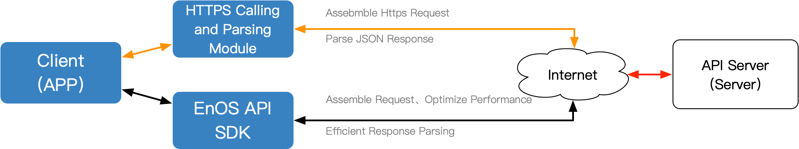

# EnOS API overview

EnOS™ provides abundant APIs covering various core business flows of the platform. Based on these APIs, developers can register, obtain, modify, and delete authorized resources (including device assets, personnel, applications, and privileges).

In this way, the developers can develop applications easily and quickly according to their business needs. Applications can get access to asset data on EnOS cloud via EnOS APIs, including asset inquiry, and inquiry of real-time and history data.

## Supported categories of APIs

EnOS mainly provides the following categories of APIs:

- **Connect Service**: Device connection and management services, including registration, acquisition, modification, and deletion of device assets.
- **Model Service**: Organization thing model information services.
- **Asset Service**: Asset and asset tree management services.
- **Data Service**: Asset measurepoint data upload service.
- **Common File Service**：File management services, including file upload, download, storage and delete.

## Approaches to call EnOS APIs

EnOS REST APIs can be called through HTTP protocol. You can choose one of the following options to call EnOS APIs:

- **Use EnOS API SDK offline**: Official SDK provided by EnOS, supporting request URL assembling, signature generation, response parsing, and APP performance optimization. You are recommended to use EnOS API SDK. For detailed instructions, see [Getting started with EnOS Java SDKs](gettingstarted_sdk).
- **Use REST APIs through online HTTP request**: Wrap up API service URL, parameters, and signatures manually to assemble HTTP requests to call an API. For detailed instructions, see [Getting started with EnOS REST APIs](gettingstarted_api).

The figure below shows the process of calling EnOS API:

## Related links

- [Getting started with EnOS REST APIs](gettingstarted_api)
- [Getting started with EnOS Java SDKs](gettingstarted_sdk)
