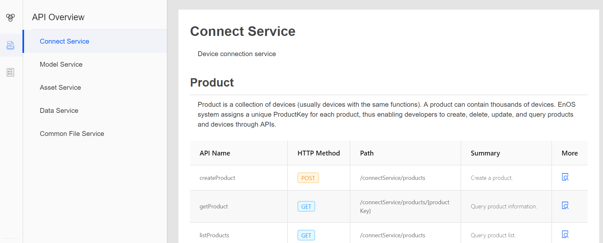
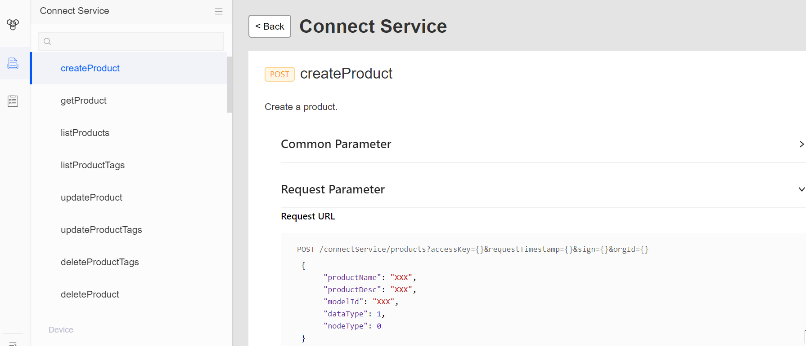

# Getting Started with EnOS REST APIs

This topic aims to help you get started with calling EnOS API to interact with your data in the EnOS™ Cloud by, such as logging in and querying the device properties, real-time and historical data. With EnOS API, you can develop your own applications based on your resources in the EnOS Cloud.

The sections below describe the major steps that you can follow to call EnOS REST APIs:

1. Register an application in the EnOS Console
2. Access the API documentation
3. Call the EnOS API
4. Test and deploy the application

**Three elements for invoking APIs**

Invoking APIs requires three types of parameters:

- API: Name of the API that you are about to invoke and the request paramters as required by the API.
- Application identity: As the identity when you invoke an API, `accessKey` and `secretKey` are used to verify your identity.
- Signature: Authentication method for API requests. It is generated based on the application key, application secret, and request parameters with an algorithm.

## Before You Start

Ensure you have resources on EnOS that you are authorized to access. The resources can be devices, data, events, user accounts, and so on. So before you start using EnOS APIs, you typically have finished connecting your devices and data into EnOS, and have a user account that has proper access policies assigned through EnOS IAM function.

## Step 1: Registering an Application

To request the EnOS APIs, you need to register an application in the EnOS cloud and obtain the application key and secret that are assigned by EnOS. The application is the account to use for accessing EnOS APIs. When you invoke an API, you need to present the application key and secret to be authenticated by EnOS.

An application must have the permission to invoke an API, and any application currently registered on EnOS™ has the permission to invoke EnOS APIs. The resource authorization, that is which devices or data you can access through the API, is enforced through IAM at the account level.

1. In the EnOS Console, click **APP Management** from the left navigation.
2. Click the **Register App** button.
3. Provide application name and description, and select a category and type for the application.

After the application is registered, EnOS assigns an application key and secret for the application, which will be used for authorization and signature validation when calling EnOS APIs.

## Step 2: Accessing API Documentation

To access the API documentation, go to **EnOS API > API Documents**. Summary of APIs is displayed in tables by API service categories. Click the **More** icon for each API to view details, including API function, calling method, requesting URL, parameter description, calling sample, and response sample. See the following screen capture.

*Figure 1. Accessing EnOS API documentation from EnOS Console*

*Figure 2. Example of API documentation*

## Step 3: Calling EnOS API

 Wrap up API service URL, parameters, and signatures manually to assemble HTTP requests to call an API. For detailed instructions, see [Calling EnOS REST APIs](call_enos_api).

## Step 4: Testing and Deploying the Application

EnOS provides a log tool to help you monitor the running status of your application. You can search for historical API calling requests by request ID, API name, or other keywords. When the application development and test is completed, you can deploy it online.
